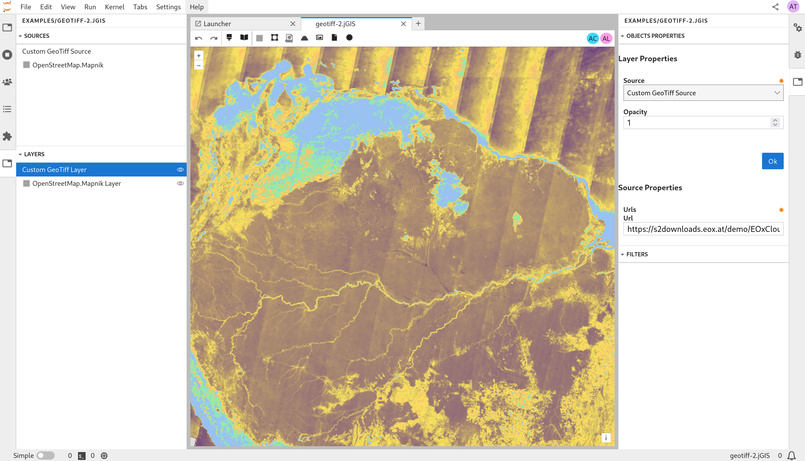

<p align="center"></p>
<h1 align="center">JupyterGIS</h1>
<h2 align="center">A JupyterLab extension for collaborative GIS</h1>

⚠️ This extension is work in progress. Features and APIs are subject to change quickly. ⚠️



## Features

- **Collaborative GIS Environment**: Work together on geographic data projects in real-time.
- **QGIS File Support**: Load, visualize, and manipulate QGIS project files (`.qgs`, `.qgz`), and other GIS data formats.
- **Interactive Maps**: Render interactive maps and geospatial visualizations within Jupyter notebooks using the JupyterGIS Python API.

## Try it directly in your browser with [JupyterLite](https://jupyterlite.readthedocs.io/en/stable/?badge=latest)!

https://geojupyter.github.io/jupytergis/lite/lab/index.html

## Installation

### Prerequisites

- JupyterLab (version 3.0 or higher)
- (OPTIONAL) QGIS installed on your system and its Python modules available in the PATH. e.g. `mamba install --channel conda-forge qgis`

### Installing JupyterGIS

#### From PyPI

```bash
python -m pip install jupytergis
```

#### From conda-forge

JupyterGIS is also packaged and distributed on [conda-forge](https://github.com/conda-forge/jupytergis-packages-feedstock).

To install and add JupyterGIS to a project with [`pixi`](https://pixi.sh/), from the project directory run

```
pixi add jupytergis
```

and to install into a particular conda environment with [`mamba`](https://mamba.readthedocs.io/), in the activated environment run

```
mamba install --channel conda-forge jupytergis
```

## Documentation

https://geojupyter.github.io/jupytergis

## Contributing

We welcome contributions from the community! To contribute:

- Fork the repository
- Make a dev install of JupyterGIS
- Create a new branch
- Make your changes
- Submit a pull request

For more details, check out our [CONTRIBUTING.md](./CONTRIBUTING.md).

## License

JupyterGIS is licensed under the BSD 3-Clause License. See [LICENSE](./LICENSE) for more information.
