# Tour

```{toctree}
:hidden:

install
```

First, [install JupyterGIS](install.md), then follow the walkthrough below.

## The interface

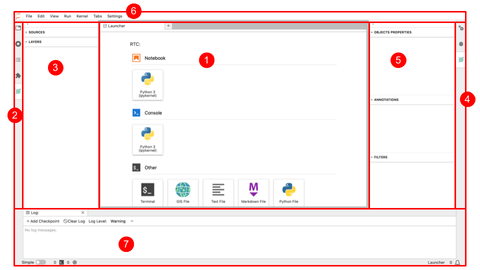

The elements shown in the figure above are:

1. **Application Launcher** — select which application to start: a Notebook, a Console, a Terminal, or open a GIS file (`.jGIS` or `.qgz`).
2. **Left Sidebar** — file browser, open tabs, running kernels, collaboration panel, table of contents, extension manager, and the GIS layers list.
3. **GIS Layers List / Browser Panel**.
4. **Right Sidebar** — property inspector, kernel usage, debugger, and GIS object properties, annotations and filters.
5. **GIS object properties, annotations and filters** of a selected GIS layer.
6. **Jupyter Toolbar Menu** — used with Jupyter Notebooks.
7. **Log Console** — used for debugging.

## First layers

Launch JupyterGIS from your terminal or use the online JupyterLite version.

1. Click on the GIS File Icon in the "Other" section of the Launcher to create a new JGIS project file. You will have a new, blank map.
   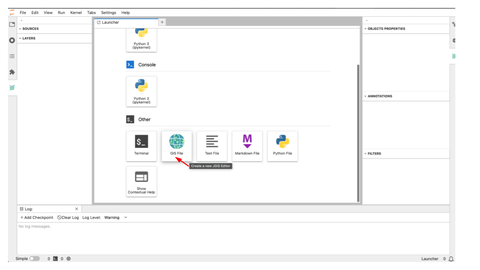
   :::{admonition} Can't see the GIS File icon?
   :class: attention
   If you don't see **GIS File** in the **Other** section of the application launcher, you may have an issue with the JupyterGIS installation. Please refer to the installation section above.
   :::
2. Open the Layer Browser (see image below) and select _OpenStreetMap.Mapnik_. An interactive map will appear and you will be able to zoom in and zoom out with your mouse.
   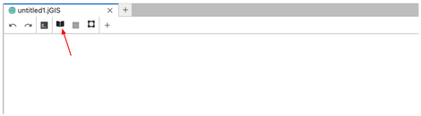
3. Click on the **+** to add a user-defined layer and select "New Shapefile Layer" to add a new vector layer (stored as a shapefile).
   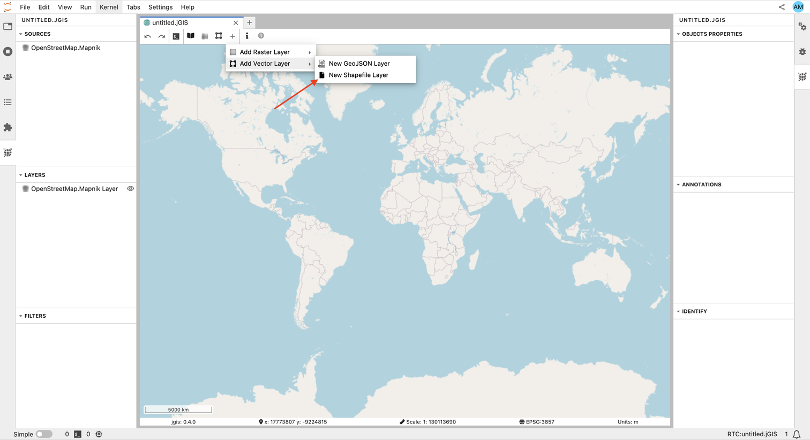
4. Set the path of the new Shapefile Layer to an open source dataset of counties in the US — `https://public.opendatasoft.com/api/explore/v2.1/catalog/datasets/georef-united-states-of-america-county/exports/shp` — and click **Ok**.
   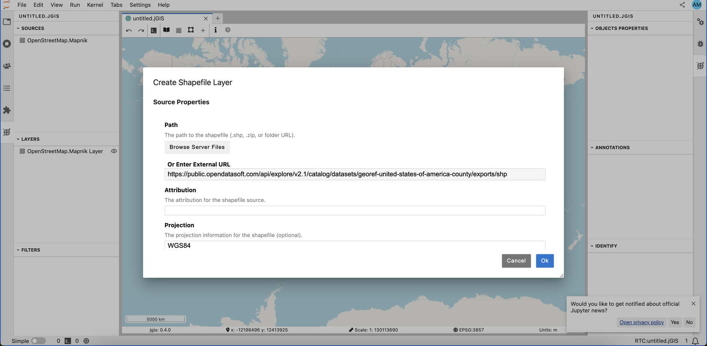
5. You will see the new Shapefile Layer on the map. When clicking on the **Custom Shapefile Layer**, you will also see the details of the object properties on the right. You can pan and zoom to focus on your area of interest, or automatically focus on your new data layer by right-clicking on the **Custom Shapefile Layer** and selecting "Zoom to Layer".
   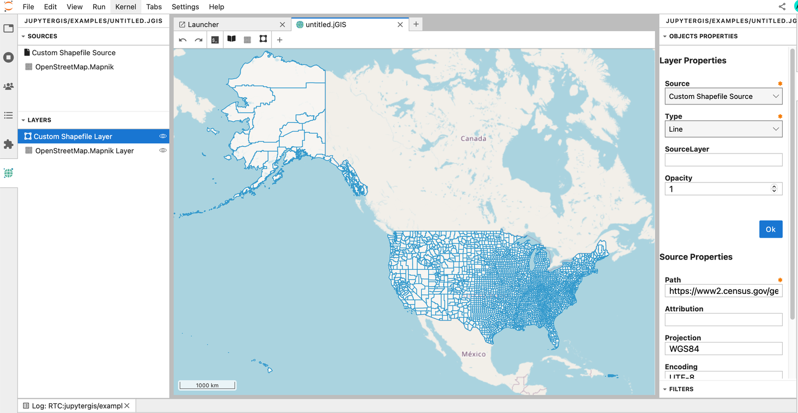

## Renaming sources and layers

When adding a new source or layer, default names are assigned. It is good practice to rename both the source and layer with meaningful names. To rename a source, select it in the GIS Sources List / Browser Panel, and right click to **Rename Source**.

Let's rename 'Custom Shapefile Source' to 'US Counties':
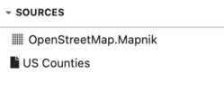

```{exercise} 1
:label: Rename-layer
:nonumber:

Rename the **Custom Shapefile Layer** with a meaningful name — e.g., **US Counties**.

```

```{solution} Rename-layer
:class: dropdown
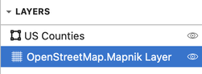
```

## Adding more layers

```{exercise-start} 2
:label: add-vector-layer
:nonumber:
```

1. Add a new Shapefile Layer to your map:
   ```
   https://docs-archive.geoserver.org/stable/en/user/_downloads/30e405b790e068c43354367cb08e71bc/nyc_roads.zip
   ```
2. Zoom over New York (USA) and check if you can see the newly added layer.
3. Rename both the newly added layer and its corresponding source, e.g. 'NYC Roads'.
4. Customize this new layer by changing the color. In the GIS Layer/Browser Panel, select the top layer and right click to **Edit Symbology**. Then change the **Stroke Color** to a color of your choice. You can also change the Stroke Width and click **Ok**.
5. In a similar way, edit the symbology of the 'US Counties' layer and change the **Fill Color**, **Stroke Color** and **Stroke Width**.
6. Do you still see the roads in New York? Try to adjust the **Opacity** value (default is 1) to a lower value. Can you see all your layers now?

```{exercise-end}

```

```{solution} add-vector-layer
:class: dropdown

After adding the new Shapefile Layer and zooming over New York, you should have the following map:
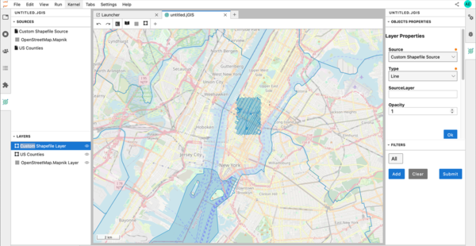

When you right click to edit the symbology, you should get the following pop-up menu:
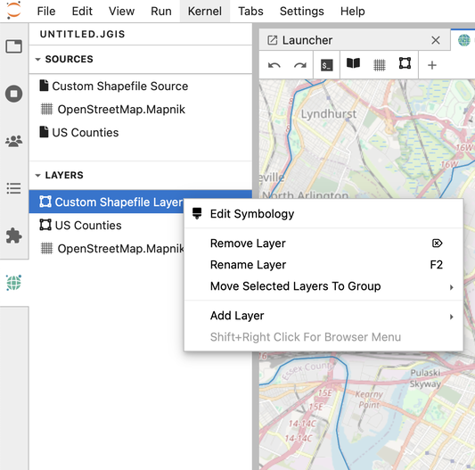

And when editing the symbology of the 'US Counties' Shapefile Layer:
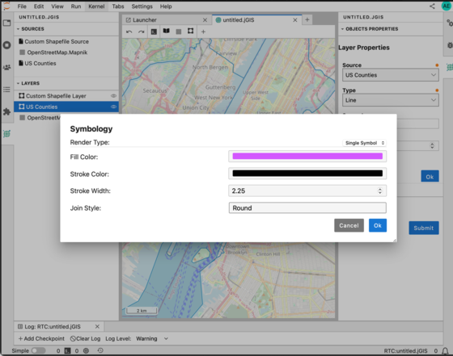

And updating the opacity (for instance to 0.5) of the US county Shapefile Layer, you can get a map that looks like this (depending on the colors and Stroke width you chose!):

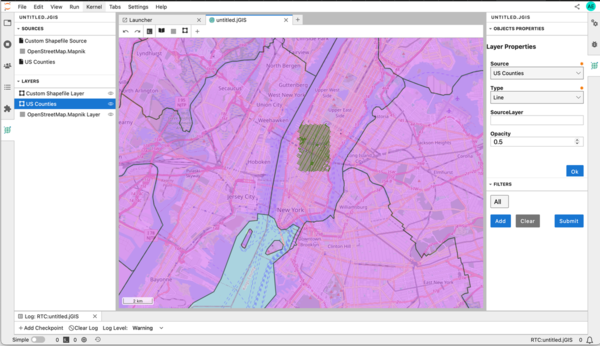
```

## Hiding and reordering layers

In the GIS Layers List/Browser Panel, you can select a layer and click the **eye** icon to hide or show the corresponding layer.
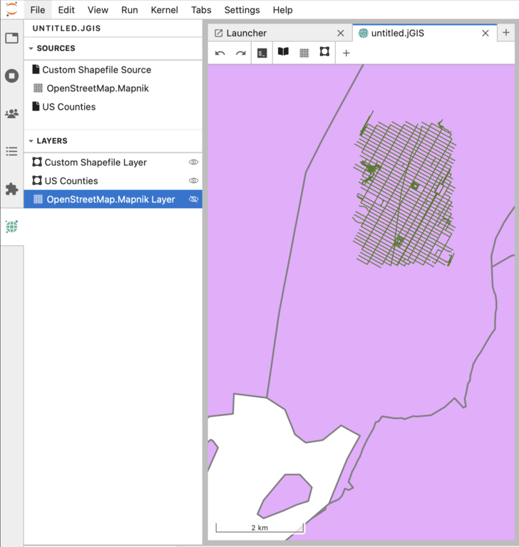

The layers in your Layers List are displayed on the map according to their order in the list. The bottom layer is drawn first, while the top layer is drawn last. You can click and drag on a layer to reorder it.

For example, this layer order would hide all the custom shapefile layers underneath the OpenStreetMap raster layer:
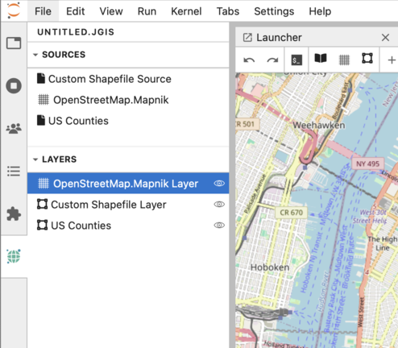

## Saving your project

Your `.jGIS` file is your GIS project (similar to `.qgz` for QGIS). To rename it, click on **File** in the Jupyter toolbar menu and select **Rename JGIS...**.

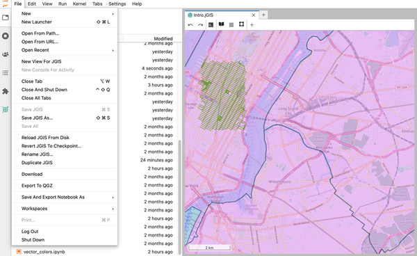
