# Getting Started with JupyterGIS

Welcome to the first tutorial in the JupyterGIS series! This guide will introduce you to the basics of JupyterGIS and help you set up your environment, create your first map, and understand its key features.

## Objectives

By the end of this tutorial, you will:

1. Understand what JupyterGIS is and its key capabilities.
2. Set up the required tools and libraries.
3. Create a simple map and add layers.
4. Explore basic geospatial analysis using JupyterGIS.

## Introduction to JupyterGIS

JupyterGIS integrates geospatial analysis with the interactivity of Jupyter Notebooks, enabling users to:

- Visualize geospatial data and create interactive maps.
- Process and analyze geospatial data.
- Share and collaborate on geospatial workflows.

JupyterGIS is designed for researchers, data scientists, and GIS professionals aiming to combine Python’s analytical power with intuitive geospatial visualizations.

## An Overview of the Interface

We will explore the JupyterGIS user interface to help you become familiar with its menus, toolbars, map canvas, and layers list, which make up the core structure of the interface.

**The objective of this lesson is to understand the fundamentals of the JupyterGIS user interface.**

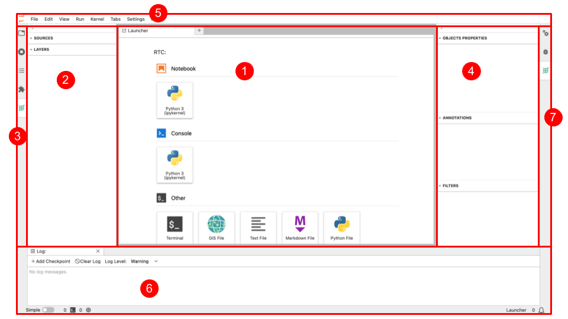

The elements shown in the figure above are:

1. The application Launcher helps you to select which application you want to start e.g. a Notebook, a Console, and another application such as a Terminal or open a GIS file (which can be either a JupyterGIS file or a QGIS file).
2. GIS Layers List / Browser Panel
3. Left Sidebar which contains a file browser, a list of tabs in the main work and of running kernels and terminals, the command palette, the table of contents, the extension manager, and the JupyterGIS extension which allows you to see the GIS layers list.
4. The GIS object properties, annotations and filters of a selected GIS layer.
5. The Jupyter toolbar menu which you will use with Jupyter Notebooks.
6. The Log console (which you can you for debugging).
7. Right Sidebar showing the property inspector (active in notebooks), the debugger, and GIS object properties, annotation and filters.

## Adding your first layers

We will start the JupyterGIS application and create a basic map.

**The goal for this lesson: To get started with an example map.**

:::{admonition} Get JupyterGIS
:class: tip
Before beginning this exercise, JupyterGIS must be installed on your computer (see [Installation instructions](https://geojupyter.github.io/jupytergis/install.html)) or you can use an online version of JupyterGIS (such as [](https://geojupyter.github.io/jupytergis/lite/lab/index.html?path=france_hiking.jGIS/)).
:::

Launch JupyterGIS from your terminal or start an online version of JupyterGIS depending on what you decided to use for this exercise.

```bash
jupyter lab
```

### Add a vector Layer

Follow along to add a vector layer available online.

1. Click on the GIS File Icon in the "Other" section of the Launcher to create a new JGIS project file. You will have a new, blank map.
   
2. Open Layer Browser (see image below) and select for instance _OpenStreetMap.Mapnik_. An interactive map will appear and you will be able to zoom in and zoom out with your mouse.
   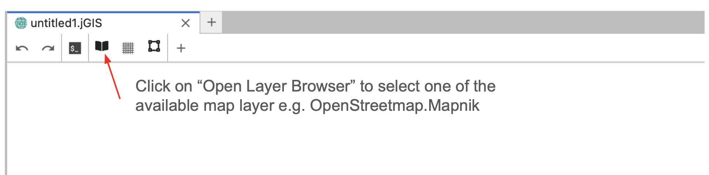
3. Click on the **+** to add another type of layer and select "New Shapefile Layer" to add a new vector layer (stored as a shapefile).
   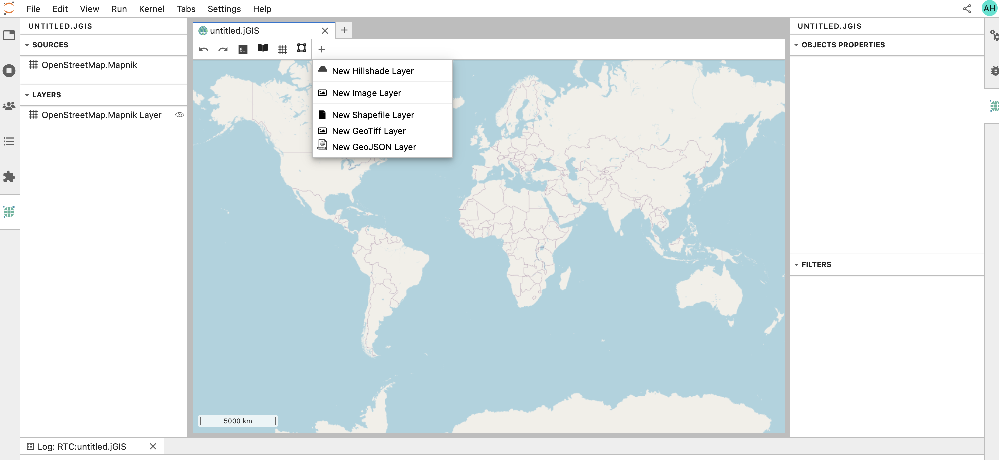
4. Set the path of the new shapefile Layer to `https://www2.census.gov/geo/tiger/GENZ2015/shp/cb_2015_us_county_500k.zip` and click **Ok**.
   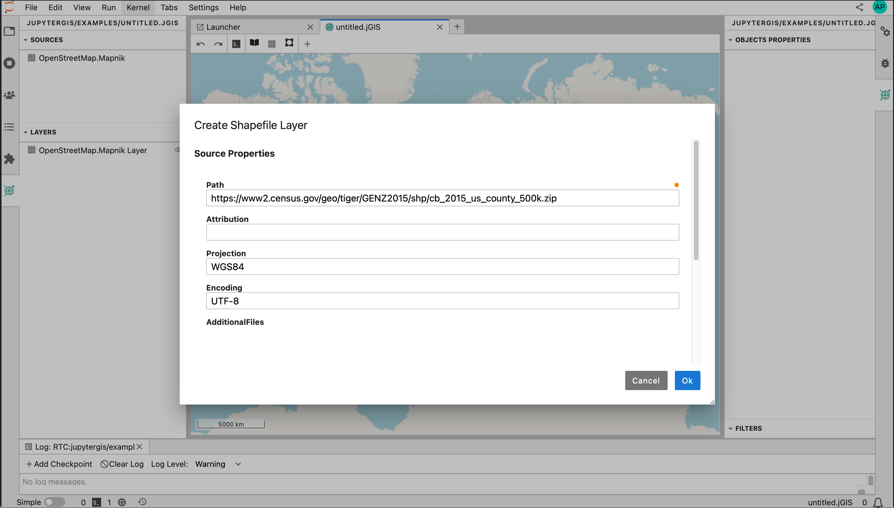
5. You should then be able to see the new Shapefile Layer on the map and when clicking on the **Custom Shapefile Layer** (see figure below), you should also see the details of the object properties on the right of the map. The map being interactive, you can zoom in and out as you wish to focus on your area of interest (here over the US).
   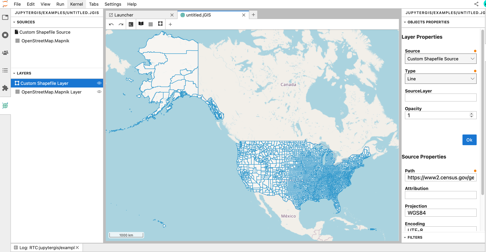

:::{admonition} Why don't we add a local shapefile?
:class: tip
One of the main strength of JupyterGIS is its collaborative capabilities. To be able to collaborate, it is much easier to work with data shared and available online.
:::

```{exercise-start}
:label: add-vector-layer
```

- Add a new Shapefile Layer to your map:

```
https://docs.geoserver.org/stable/en/user/_downloads/30e405b790e068c43354367cb08e71bc/nyc_roads.zip
```

- Zoom over New-York (USA) and check if you can see the newly added layer.
- Let's customize this new layer by changing the color. In the GIS Layer/Browser Panel, select the top layer (corresponds to the last layer you added) and right click to **Edit Symbology**. Then change the **Stroke Color** to a color of your choice. You can also change the Stroke Width and check the result after pressing \*_OK_.
- In a similar way, you can edit the symbology of the first Shapefile Layer we added and change the **Fill Color**, **Stroke Color** and **Stroke Width**.
- Do you still see the roads in New-York? Try to adjust the **Opacity** value (default is 1) to a lower value for this Shapefile Layer. Can you see all your layers now?

```{exercise-end}

```

```{solution} add-vector-layer
:class: dropdown

After adding the new Shapefile Layer and zooming over New-York, you should have the following map:
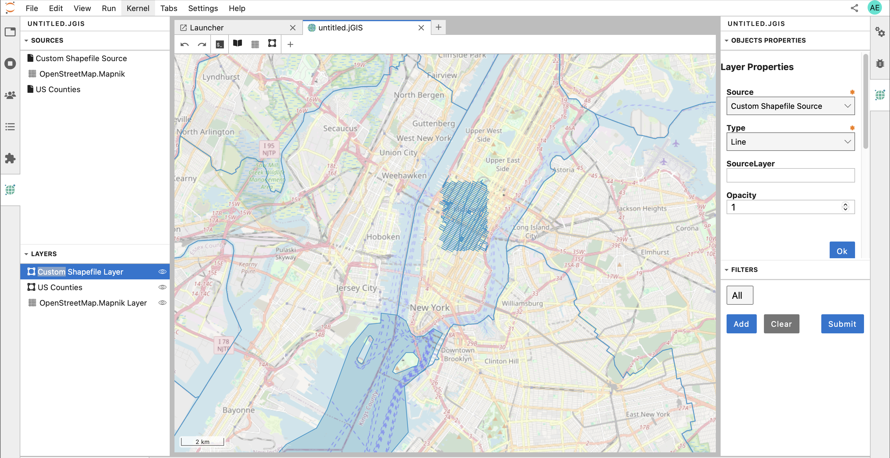

When you right click to edit the symbology, you should get the following pop-up menu:
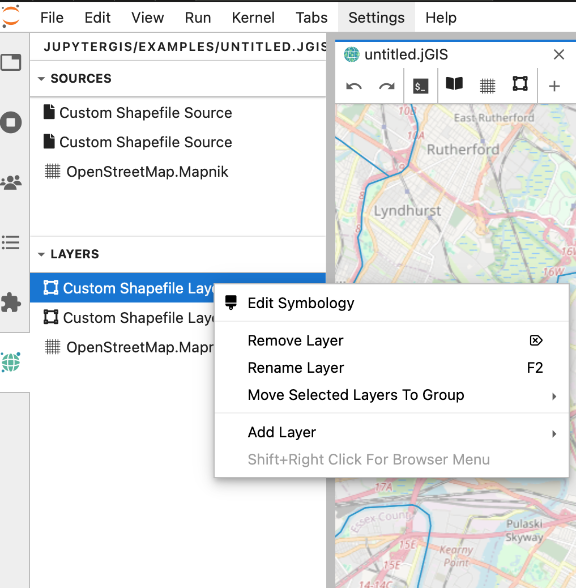

And when editing the symbology of the other Shapefile Layer:
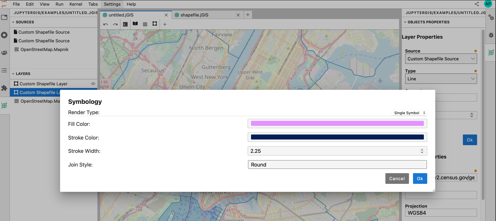

And updating the opacity (for instance to 0.5) of the US county Shapefile Layer, you can get a map that can look like to (depending on the colors and Stroke width you chose!):

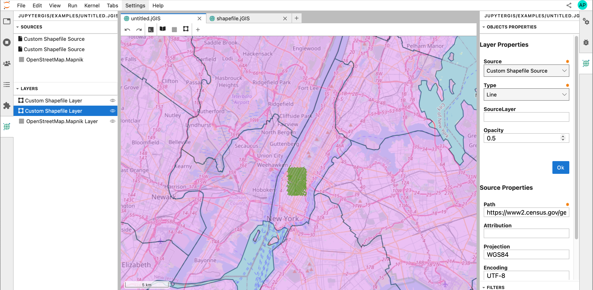
```

## Hiding and Reordering Layers

### Hiding/Viewing Layers

In the GIS Layers List/Browser Panel, you can select a layer and click the **eye** icon to hide or show the corresponding layer.
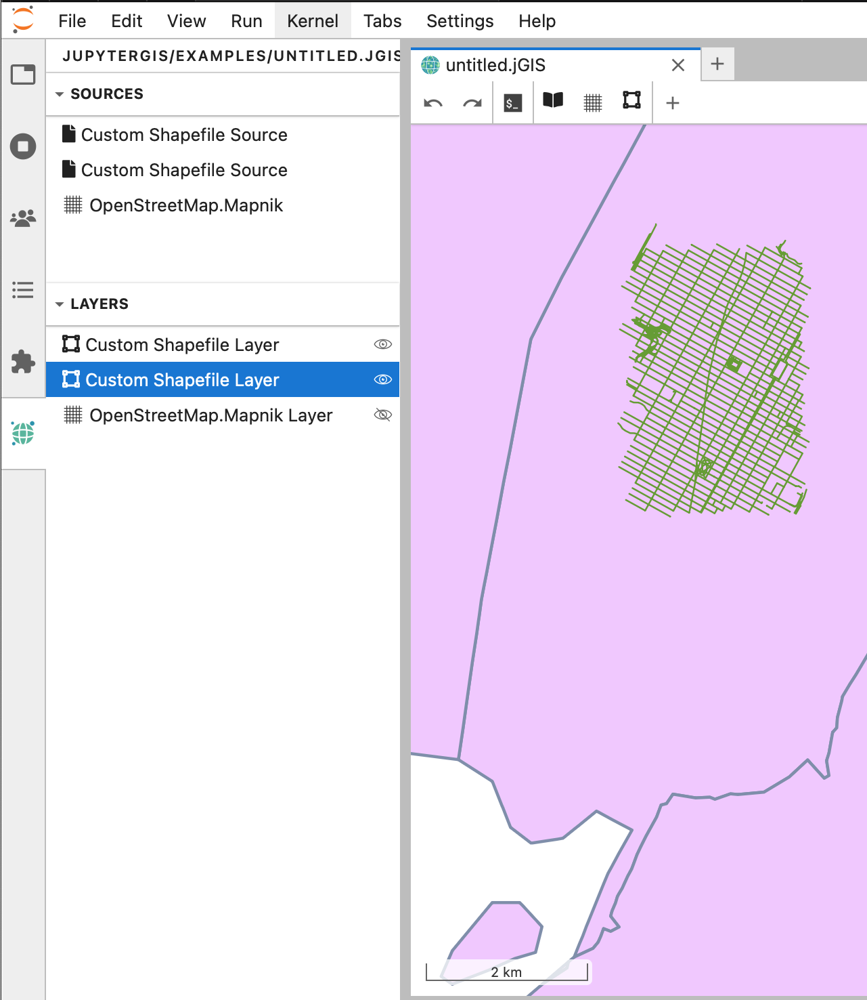

### Reordering Layers

The layers in your Layers List are displayed on the map according to their order in the list. The bottom layer is drawn first, while the top layer is drawn last. You can adjust their drawing order by rearranging the layers in the list.

The order in which the layers have been loaded into the map is probably not logical at this stage. It’s possible that the road layer or/and the country layer are completely hidden because other layers are on top of it.

For example, this layer order:
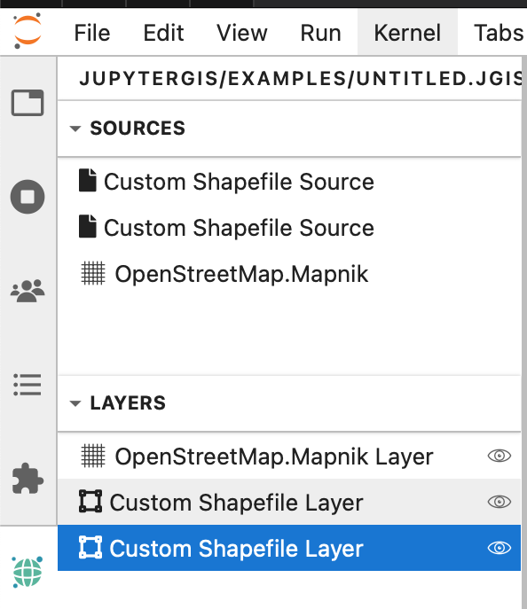

would hide all the custom shapefile layers.

To solve this problem, you can click and drag on a layer in the Layers list to move it up or down, and reordering the layers as you wish them to be viewed on the map.

## Renaming Layers

As shown on the previous image, the two custom shapefile layers we added have the same name in the GIS Layers List / Browser Panel which can be very confusing.
It is a good practice to rename your layers with meaningful names. To rename a layer, select it in the GIS Layers List / Browser Panel, and right click to **Rename Layer**.

```{exercise-start}
:label: Rename-layer
```

- Rename each **Custom Shapefile Layer** with a meaningful name e.g., **cb_2015_us_county_500k** for the US County Shapefile Layer and **nyc_roads** for the roads in New-York.

```{exercise-end}

```

```{solution} Rename-layer
:class: dropdown
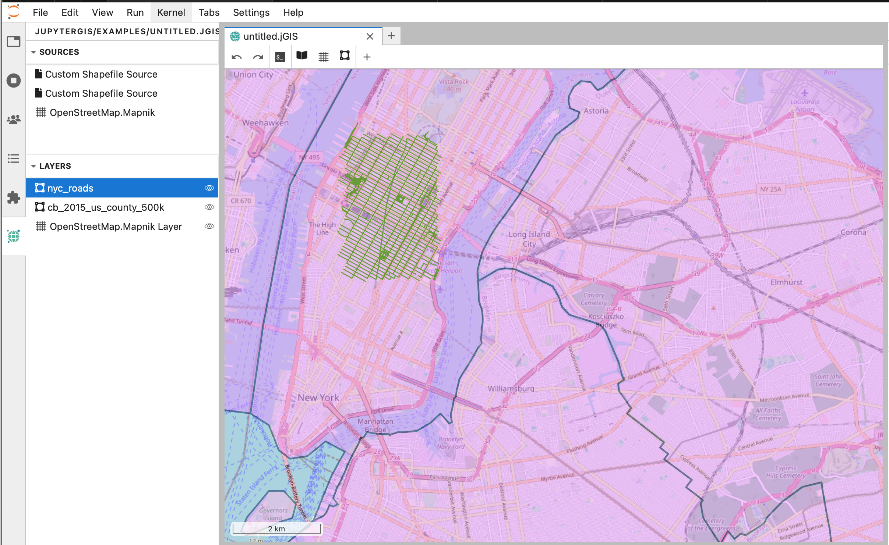
```

## Save your JGIS project

Your jGIS file corresponds to your GIS project (similar to `.qgz` for QGIS) and you probably already noticed that the default name is `untitled.jGIS`. If you created several jGIS files without renaming them, a number will be added before the extension e.g. `untitled1.jGIS`, `untitled2.jGIS`, etc.

It is important to give meaningful name to your jGIS project.

To rename it, you can click on **File** in the Jupyter toolbar menu and select **Rename JGIS...** to give a new name to your jGIS project.

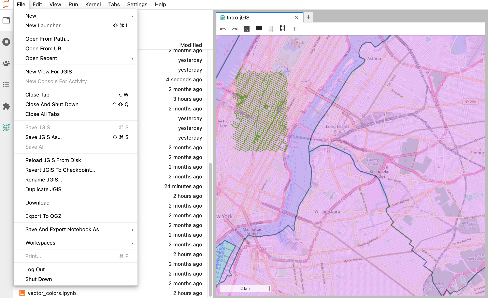

## Conclusion

Now you’ve learned how to add all the layers you need from various sources and have created a basic map!

## Additional resources

- [JupyterGIS Documentation](https://geojupyter.github.io/jupytergis)
- [Folium Library](https://python-visualization.github.io/folium/latest/)
- [Geopandas Documentation](https://geopandas.org/en/stable/docs.html)
- [QGIS Documentation](https://www.qgis.org)
- [QGIS Tutorials and Tips](https://www.qgistutorials.com/en/index.html)

Happy Mapping!
