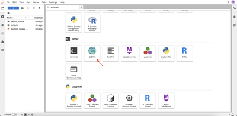
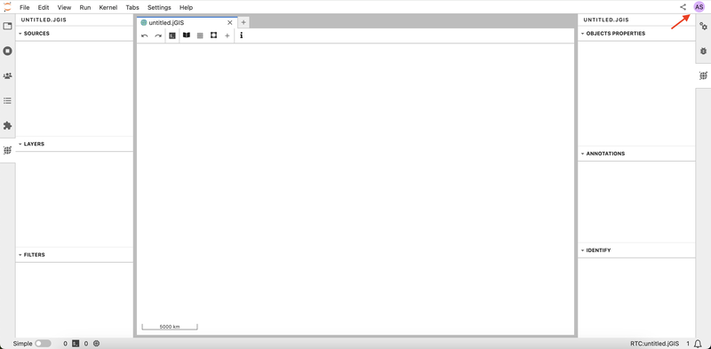
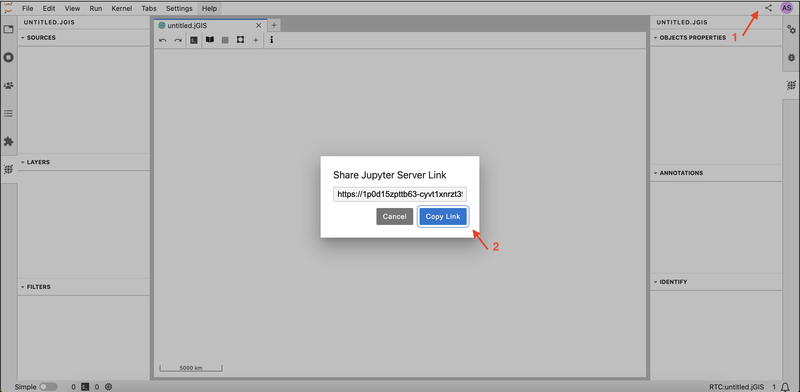
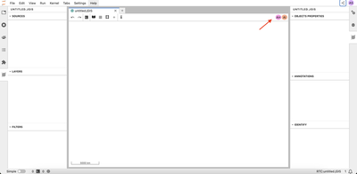
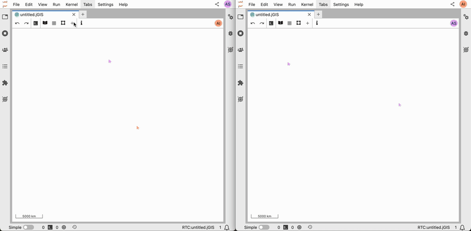
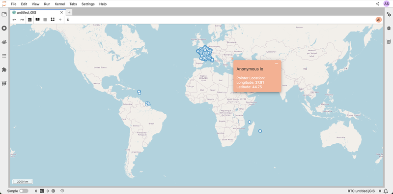
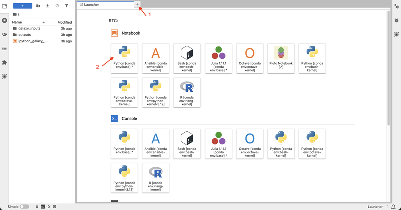
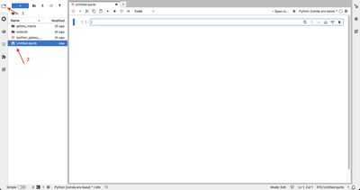

# Collaborative Features in JupyterGIS

Welcome to the JupyterGIS collaborative features tutorial. JupyterGIS enables seamless sharing of notebooks and GIS files, allowing teams—including GIS specialists, data analysts, and other experts—to work together on spatial projects in a shared environment. This guide will provide you with the tools and steps needed to collaborate effectively, using features like real-time editing, cursor tracking, follow mode, and annotations.

## Motivation

Collaboration is at the heart of effective GIS projects. Teams often include members with diverse backgrounds, skills, and areas of expertise. Without robust collaborative tools, it can become challenging to share insights, make real-time decisions, and maintain consistency across project workflows. JupyterGIS simplifies collaboration by providing real-time editing, annotations, and interactive features that allow teams to seamlessly integrate their work.

:::{admonition} Objectives
:class: seealso
By following this tutorial, you will be able to:

- Generate shareable links to invite collaborators.
- Work together on GIS files and notebooks with live updates.
- Use follow mode to monitor collaborator activities.
- Add annotations and comments to provide context, ask questions, or share insights.

:::

:::{admonition} Prerequisites
:class: warning
Before beginning this tutorial, JupyterGIS must be installed on your computer (see [Installation instructions](https://jupytergis.readthedocs.io/en/latest/user_guide/install.html)). Alternatively, you can use an online installation of JupyterGIS. Your choice may have implications for collaboration, so please read our [collaboration feature overview](../../features/collab.md) for more context.
:::

---

## Sharing Your Document

First, let's create a GIS file and invite collaborators to the session.

### Create Your GIS File

1. Open JupyterLab

   - If you are using a local installation, start JupyterLab.

     ```
     jupyter lab
     ```

   - If you are using an online version, navigate to the JupyterGIS platform.

2. In the JupyterLab Launcher, scroll down to the **Other** section.
3. Click **GIS File** to open a blank canvas for your project.
   
4. Notice that you are given an anonymous username, which you can see in the upper right corner. Every user in the project will be assigned an anonymous username.
   

### Generate a Shareable Link

You can invite collaborators to your session by sharing a link. Click on the **Share** button in your interface in the upper right corner, then click on the **Copy Link** button.



### Confirm Collaborator Access

When your colleagues join using the link, their usernames appear in the top right corner. This lets you know exactly who is working on the document. There are two more collaborators in the session in the example below.



---

## Real-Time Collaboration on a GIS File

### Adding and Editing Layers

When you add a new layer to your GIS file, the new layer appears immediately for all collaborators in your session. You can experiment by adding a layer from the layer browser or from the add layer menu, and customizing its symbology, such as changing the opacity or color. Observe that each change is instantly visible to your collaborators. You can check the [Getting Started with JupyterGIS](../01-intro/index.md) tutorial for more details on how to customize the layer appearance.



### Tracking Collaborators with Cursors

Each user's cursor appears on the document in the same color as their icon. This feature makes it easy to see where your teammates are focused on. You can click on a cursor to display the location (latitude and longitude) where collaborators are working.



---

## Using Follow Mode

Follow mode allows you to track another user’s activity in the document in real time. When enabled, you’ll see their actions as they navigate and edit. This feature is ideal for live demonstrations, interactive sessions, and collaborative meetings, as it lets you quickly align your view with a teammate’s actions and provide immediate feedback.

### Activating Follow Mode

To activate the follow mode, click on a collaborator's user icon in the upper right corner. Observe that the document will then have a frame in their assigned color. You can click on the user icon again to exit follow mode.


````{exercise} 1
:label: enable-follow-mode
:nonumber:

1. Create a new collaborative JupyterGIS session.
2. Share the link with a colleague. If you are completing this tutorial without other collaborators, you can open a new browser and paste the link to simulate a different user.
3. From the layer browser, add OpenStreetMap.Mapnik to your GIS file.
4. Ask your colleague to add the World Air Quality GeoJSON layer:
    ```
    https://public.opendatasoft.com/api/explore/v2.1/catalog/datasets/openaq/exports/geojson
    ```
5. Locate your colleague's cursor on the document.
6. Enable follow mode to track your colleague's actions.

````

```{solution} enable-follow-mode
:class: dropdown

1. Open a new GIS file in JupyterGIS. Click the **Share** button and copy the link. Send this to your colleague.
2. In the layer browser, select **OpenStreetMap.Mapnik**.
3. Your colleague can add the GeoJSON URL by clicking **+** → **New Vector Layer** → **Add GeoJSON Layer** → pasting the provided URL.
4. You can find their cursor on the map.
5. Click on your colleague's icon on the top right corner to activate **Follow Mode**. Your screen will follow their movements and edits in real-time.

```

---

## Adding Annotations and Comments

Annotations and comments let you add notes directly on your GIS file, which makes it easier for your team to track important details, provide context, ask questions, or share insights.

### Creating Annotations

In order to create annotations, you can right-click anywhere on your GIS file to open the context menu, then select **Add Annotation** from the menu. Observe that all collaborators can see the new annotation in real time.

### Adding and Viewing Comments

Once you add an annotation, you can click on it to type your comment. You can open the right sidebar to view all annotations and comments in the document, and click on the middle button to locate the annotation.


```{exercise} 2
:label: add-annotations
:nonumber:

1. Add an annotation to your GIS file. Then add a comment to the annotation.
2. Ask your colleague to locate the annotation and add a reply.
3. Locate your colleague's reply from the right sidebar.

```

```{solution} add-annotations
:class: dropdown


1. Right click on the desired location on your map.
2. Choose **Add Annotation**, click on the annotation and enter your comment.
3. Your colleague can see your annotation instantly; they can click it and reply.
4. Open the annotations panel on the right sidebar to view their reply.

```

---

## Collaborating on Notebooks

Real-time collaboration in notebooks is a powerful tool for teams working on code together. It enables multiple users to write, edit, and run code simultaneously. This feature is ideal for live coding sessions, debugging, and data analysis projects.

### Accessing a Shared Notebook

To create a notebook, you can click on the **+** icon to open the Launcher, then select one of the kernels under **Notebook**.


Once a notebook is created, it is automatically accessible to all collaborators—no additional sharing is needed. To open a shared notebook, you can click on the explorer button in the left sidebar, then locate and click on the notebook. Anyone in the session can open, edit, and run the notebook.


### Real-Time Code Collaboration

As you write or execute code, every change is visible to your team instantly. Multiple users can write, edit, and run code in the same notebook at the same time for a dynamic, interactive coding experience.


```{exercise} 3
:label: notebook-collaboration
:nonumber:

1. Create a new notebook and load your GIS document.
2. Ask your colleague to open the notebook, write the code to remove the air quality layer of the GIS file and run the code cell.

```

````{solution} notebook-collaboration
:class: dropdown

1. Create a new notebook from the JupyterLab launcher (select Python kernel).
2. Load your GIS document using the following Python code:
    ```python
    from jupytergis import GISDocument
    doc = GISDocument("your_project_name.jGIS")
    ```
3. Your colleague can add and execute the following code to list all layers:
    ```python
    doc.layers
    ```
4. Then they can find the air quality layer ID (the layer with the name Custom GeoJSON Layer) and remove it using:
    ```python
    air_quality_layer_id = "your_layer_id"
    doc.remove_layer(air_quality_layer_id)
    ```
````

---

Congratulations! You have completed the Collaboration Features of JupyerGIS tutorial. You now have the knowledge and tools to collaborate effectively with your team on GIS files and notebooks.

If you'd like to explore more of JupyterGIS' functionality, please view our
[JupyterGIS announcement blog post](https://blog.jupyter.org/real-time-collaboration-and-collaborative-editing-for-gis-workflows-with-jupyter-and-qgis-d25dbe2832a6)
for video demos of more features.
