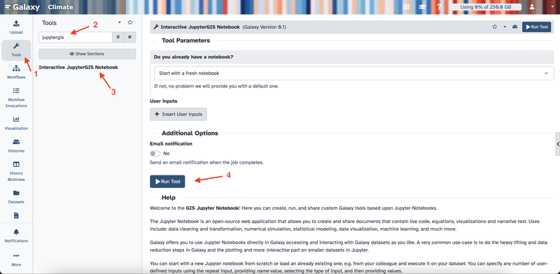
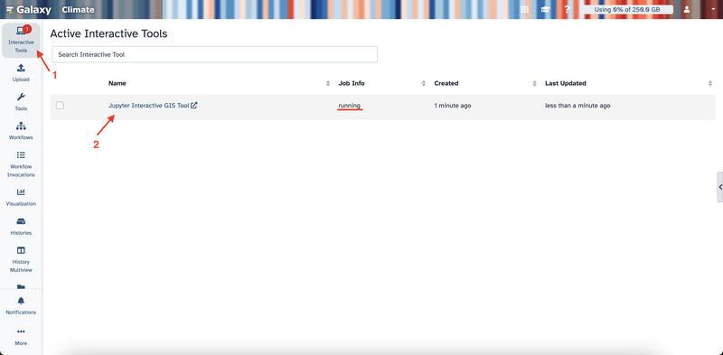

# Collaborative Features in JupyterGIS

Welcome to the JupyterGIS collaborative features tutorial. JupyterGIS enables seamless sharing of notebooks and GIS files, allowing teams—including GIS specialists, data analysts, and other experts—to work together on spatial projects in a shared environment. This guide will provide you with the tools and steps needed to collaborate effectively, using features like real-time editing, cursor tracking, follow mode, and annotations.

## What You'll Learn

By following this tutorial, you will be able to:
- Launch a collaborative session in JupyterGIS.
- Generate shareable links to invite collaborators.
- Work together on GIS files and notebooks with live updates.
- Use follow mode to monitor collaborator activities.
- Add annotations and comments to provide context, ask questions, or share insights.
---

## 1. Launching Your Collaborative Session

### 1.1. Access the Platform
- Open your browser and navigate to [https://climate.usegalaxy.eu/](https://climate.usegalaxy.eu/).
- Log in or register for an account if you haven't already.

### 1.2. Start JupyterGIS
- On the left sidebar, click **Tools**.
- In the search box, type **JupyterGIS**.
- Click **Interactive JupyterGIS Notebook** and then click the **Run Tool** button.

- Click on **Interactive Tools** on the left sidebar.
- Wait a few minutes until the job status changes to “running.”
- Click on the **Jupyter Interactive GIS Tool** link that appears to open JupyterLab.

### 1.3. Create Your GIS File
- In the JupyterLab Launcher, scroll down to the **Other** section.
- Click **GIS File** to open a blank canvas for your project.  

- Notice that you are given an anonymous username, which you can see in the upper right corner. Every user in the project will be assigned an anonymous username.

---

## 2. Sharing Your Document

### 2.1. Generate a Shareable Link
- Click on the **Share** button in your interface on the upper right corner, then click on the **Copy Link** button.
- Share this link with colleagues to invite them to your session.  

### 2.2. Confirm Collaborator Access
- When your colleagues join using the link, their usernames appear in the top right corner.
- This lets you know exactly who is working on the document.  

---

## 3. Real-Time Collaboration on a GIS File

### 3.1. Adding and Editing Layers
- Open the layer panel and add a new layer to your GIS file.
- The new layer appears immediately for all collaborators in your session.
- Experiment by adjusting settings like opacity or color, each change is instantly visible to your collaborators.

### 3.2. Tracking Collaborators with Cursors
- Each user's cursor appears on the document in the same color as their icon. This feature makes it easy to see where your teammates are focused on.
- Click on a cursor to display the location (latitude and longitude) where that user is working.

---

## 4. Using Follow Mode
Follow mode allows you to track another user’s activity in the document in real time. When enabled, you’ll see their actions as they navigate and edit. This feature is ideal for live demonstrations, interactive sessions, and collaborative meetings, as it lets you quickly align your view with a teammate’s actions and provide immediate feedback.

### 4.1. Activating Follow Mode
- Click on a collaborator's user icon in the upper right corner to activate follow mode. Observe that the document will then have a frame in their assigned color.
- Click on the user icon again to exit follow mode.

---

## 5. Adding Annotations and Comments
Annotations and comments let you add notes directly on your GIS file, which makes it easier for your team to track important details, provide context, ask questions, or share insights.

### 5.1. Creating Annotations
- Right-click anywhere on your GIS file to open the context menu.
- Select **Add Annotation** from the menu. Observe that all collaborators can see the new annotation in real time.

### 5.2. Adding and Viewing Comments
- After adding an annotation, click on it to type your comment.
- Open the right sidebar to view all annotations and comments in the document. 
- Click on the middle button to locate the annotation.

---

## 6. Collaborating on Notebooks

Real-time collaboration in notebooks is a powerful tool for teams working on code together. It enables multiple users to write, edit, and run code simultaneously. This feature is ideal for live coding sessions, debugging, and data analysis projects.

### 6.1. Accessing a Shared Notebook
- To create a notebook, click on the **+** icon to open the Launcher, then select one of the kernels under **Notebook**.

- Once a notebook is created, it is automatically accessible to all collaborators—no additional sharing is needed.
- To open a shared notebook, click on the explorer button in the left sidebar, then locate and click on the notebook.

- Anyone in the session can open, edit, and run the notebook.

### 6.2. Real-Time Code Collaboration
- As you write or execute code, every change is visible to your team instantly.
- Multiple users can write, edit, and run code in the same notebook at the same time for a dynamic, interactive coding experience.

---

Congratulations! You have completed the Collaboration Features of JupyerGIS tutorial. You now have the knowledge and tools to collaborate effectively with your team on GIS files and notebooks. 
