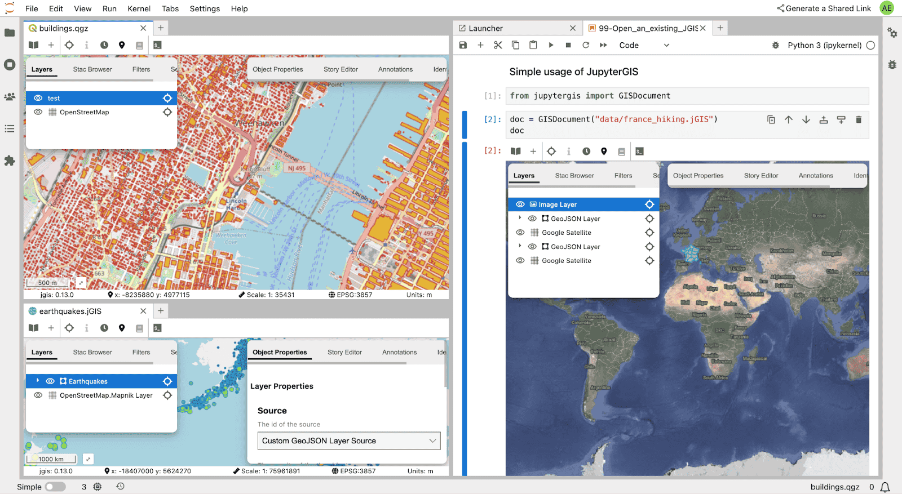
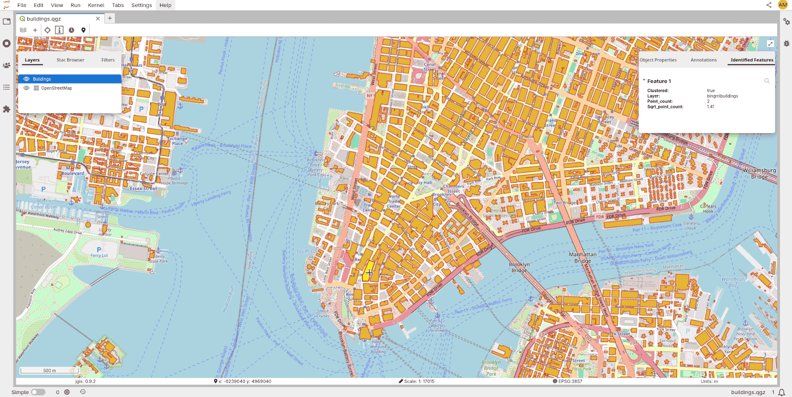
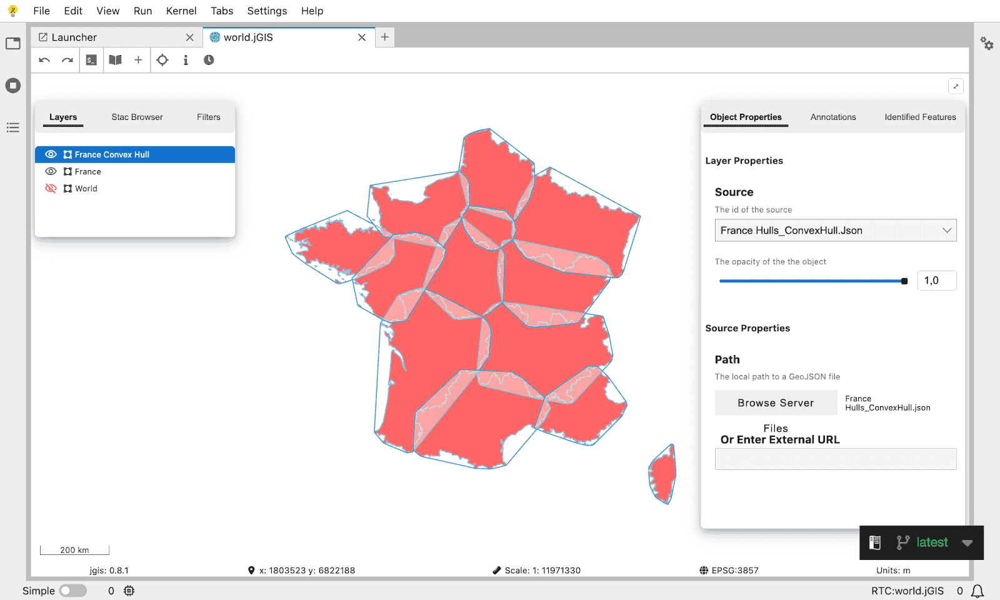
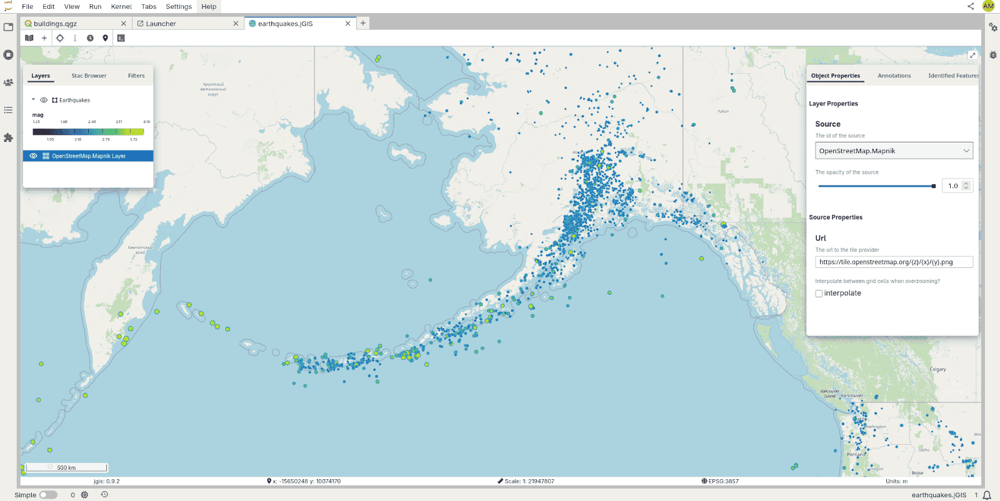
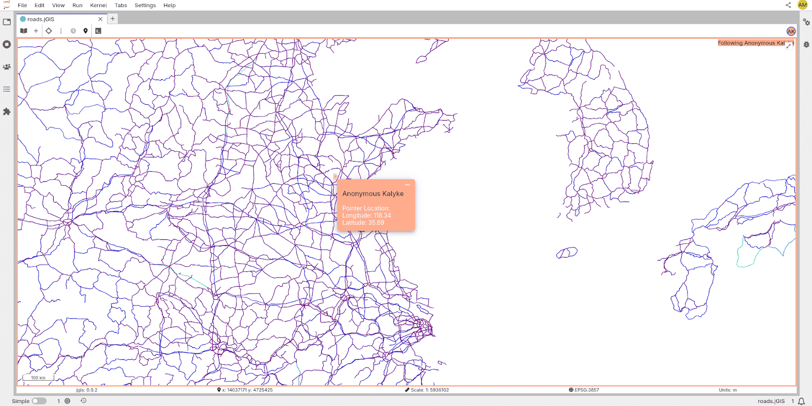
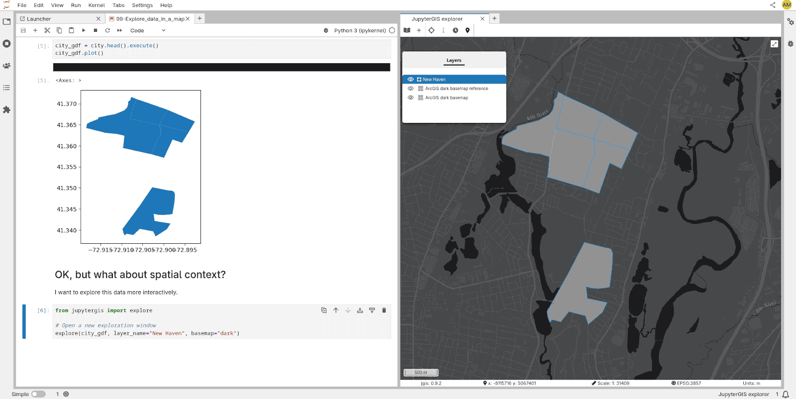
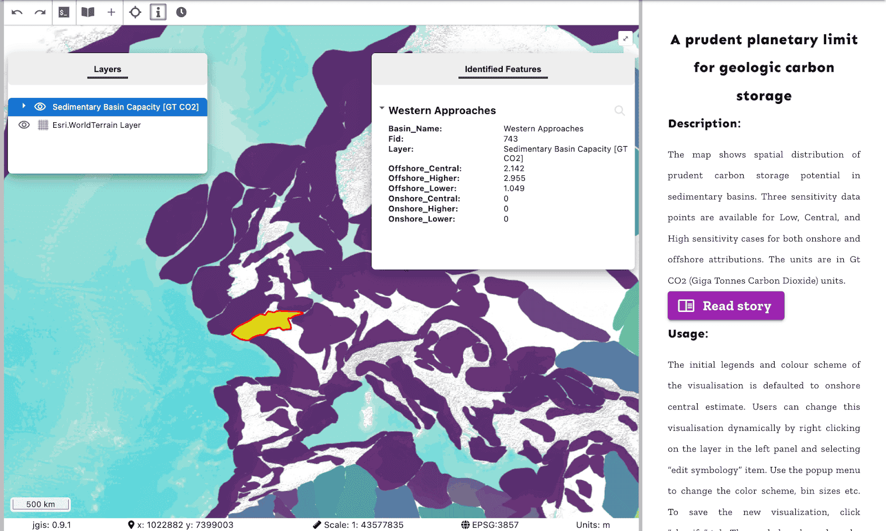
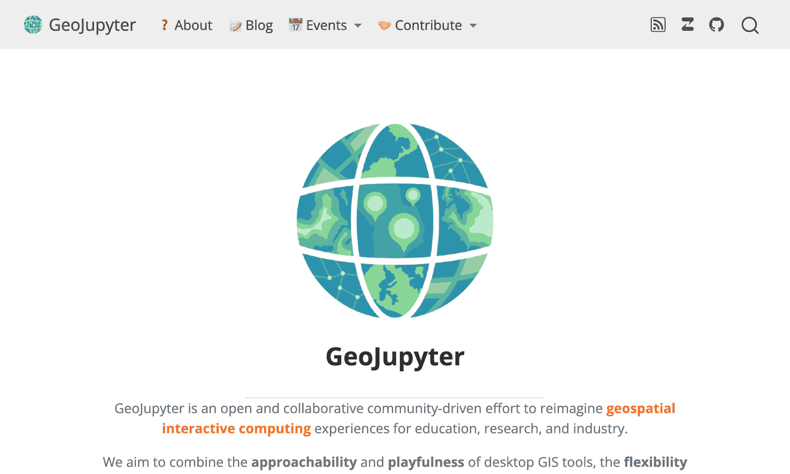
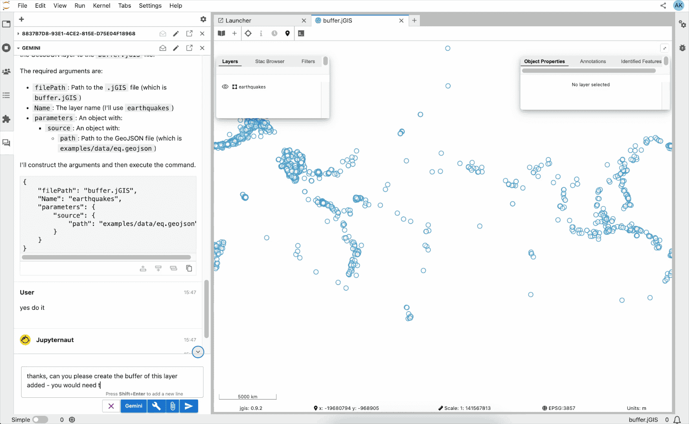

# Summary

JupyterGIS is a JupyterLab [@JUPY2018] extension that enables collaborative, web-based Geographic Information System (GIS) workflows. It provides a familiar GIS interface inspired by traditional desktop GIS tools, real-time collaborative editing, and a Python API for programmatic control, making it a powerful tool for geospatial data analysis, visualization, and sharing. JupyterGIS supports a wide range of geospatial data formats, including GeoTIFFs and Cloud-Optimized GeoTIFFs, Shapefile, GeoParquet, and PMTiles, and provides advanced features such as symbology editing, spatio-temporal animations, and a browser-based processing toolbox powered by WebAssembly (WASM) builds of GDAL [@GDAL2025].

The extension is designed to enhance productivity and collaboration among researchers, educators, developers, or any person working with geospatial data.

# Statement of need

Geospatial data analysis and visualization are essential in fields such as environmental science, urban planning, and disaster management. However, traditional GIS tools often lack **real-time collaboration** and seamless integration with computational **notebooks**. JupyterGIS addresses these gaps by:

- Enabling **real-time collaborative editing** (similar to Google Docs) for GIS projects.
- Providing **interactive maps and geospatial visualizations within Jupyter notebooks**.
- Supporting **programmatic control** via a Python API, allowing for automation and reproducibility.
- Offering **browser-based access to GIS workflows**, reducing the need for desktop software.

JupyterGIS is particularly valuable for teams working on shared geospatial projects, educators teaching GIS concepts, and researchers who need to integrate GIS workflows with data science tools.

# State of the field

Geospatial analysis and visualization rely on a diverse ecosystem of tools, each addressing specific needs. The landscape includes closed-source solutions, open-source alternatives, cloud-based platforms, and notebook-integrated tools.

However, none of the existing open-source offerings fully address the growing demand for real-time collaboration.

## Closed-Source Desktop Solutions

**ESRI's ArcGIS** remains the dominant proprietary GIS platform, offering comprehensive tools for data management, analysis, and visualization. While ArcGIS Online provides cloud-based collaboration features, it is not as instantaneous. Edits are synchronized at scheduled intervals or manually, not in real time.

## Open-Source Desktop Solutions

**QGIS** is the leading open-source desktop GIS, renowned for its extensibility, support for diverse data formats, and active community. It provides a powerful alternative to proprietary software but lacks native real-time collaborative editing of GIS documents. As a desktop software, it must be installed on the user’s device.

## Proprietary Cloud-Based Platforms

**Google Earth Engine** enables large-scale geospatial analysis in the cloud, excelling in remote sensing and large-scale data processing. However, its focus on script-based workflows and lack of interactive, collaborative editing make it less suitable for teams needing real-time collaboration or integration with local data science tools.

## In-Notebook Tools

Libraries like [ipyleaflet](https://github.com/jupyter-widgets/ipyleaflet) and [folium](https://github.com/python-visualization/folium) bring interactive mapping to Jupyter notebooks, enabling lightweight visualization of geospatial data. While useful for exploratory analysis, these tools lack a graphical user interface for non-developers willing to create GIS documents with advanced layer styling.

# JupyterGIS

JupyterGIS brings an interactive Desktop-style GIS experience (like QGIS) in a web interface including real-time **collaborative editing** features for GIS documents, enabling teams to work together seamlessly, much like coediting documents online text-processing tools.

It supports a wide range of **geospatial data formats**, including GeoTIFFs and Cloud-Optimized GeoTIFFs, Shapefile, GeoParquet, and PMTiles, and provides advanced features such as symbology editing, spatio-temporal animations, and a browser-based processing toolbox powered by WebAssembly (WASM) builds of GDAL. JupyterGIS also allows for editing QGIS files directly, with a partial support of the QGIS features.

JupyterGIS includes a **Python API**, which allows editing GIS documents interactively from Jupyter notebooks and consoles. The Python API leverages the Jupyter rich mime type rendering features to display geographical data inline in notebooks. The Python API operates on the shared model like a collaborator in the collaborative editing framework.

JupyterGIS is designed for flexibility and accessibility, supporting deployment across a wide range of Jupyter environments, from **JupyterHub**, the go-to solution for multi-user Jupyter deployments, to **JupyterLite**, which runs entirely in the web browser.

JupyterGIS has been built from the ground up to be extensible with plugins. Several extensions have been created by the development team. Most notably, the [**JupyterGIS-tiler**](https://github.com/geojupyter/jupytergis-tiler) project, which enables an integration with the Pangeo ecosystem, and allows to display Xarray Python variables as layers in JupyterGIS documents.

Finally, JupyterGIS includes basic support for browsing SpatioTemporal Asset Catalogs (STAC) interactively and displaying the assets on GIS documents.



## Support for QGIS and jGIS project files

- JupyterGIS can open existing QGIS project files (such as .qgz and .qgs) directly in JupyterLab, allowing users to continue work started in desktop GIS.
- New .jGIS project files can be created entirely within JupyterLab, enabling users to start projects without a desktop GIS tool.
- This interoperability makes it easy to move between desktop GIS environments and JupyterLab while preserving layer configurations, data sources, and project structure.



## Interactive map and layer management

- Users can **add**, **rename**, **delete**, and **reorder** layers using an intuitive interface made of context menus and drag and drop.
- A broad range of layer types is supported, including vector formats (**GeoJSON**, **Shapefile**, **GeoParquet**), raster formats (**COG**), as well as **raster and vector tile layers**.
- The interface allows **zooming to a layer’s bounding box** for quick navigation and centering.
- Vector Layer data can be downloaded or exported, enabling reuse of datasets outside the JupyterGIS environment.

## A lightweight processing toolbox

- JupyterGIS includes a set of commonly used spatial operations such as buffering, dissolving, centroid computation, and generating convex or concave hulls.



## Symbology and styling options

- A symbology panel lets users apply various styles to vector layers including single symbol, graduated, categorized, canonical, and heatmap renderers.
- Raster layers can be visualized using single-band or multi-band symbology, useful for displaying imagery or multidimensional raster products.
- These styling tools allow clear and expressive map visualization without leaving the JupyterLab environment.




## Interactive tools and dynamic visualizations

- The “identify” tool allows clicking on features to view their attributes, similar to traditional desktop GIS exploration.
- Time-dependent datasets can be animated, supporting visualization of changes across time such as environmental monitoring or temporal event sequences.
- These tools enhance exploratory analysis and make it easier to interact with complex spatial data.

## Real-time collaboration and annotation

- JupyterGIS supports true real-time multi-user collaboration: multiple users can edit the same map simultaneously.
- A follow mode allows one user to follow another’s viewpoint on the map, helpful for guided exploration or teaching.
- Users can add map annotations, participate in discussions tied to geographic context, and see other collaborators’ cursors or pointers directly on the map.
- This makes JupyterGIS well-suited for remote teams, workshops, or shared data review sessions.



## Python API and notebook integration

- A comprehensive Python API allows programmatic control of JupyterGIS projects: creating or opening projects, adding layers, editing map content, and applying many of the same operations available in the UI.
- The Python runtime behaves like another collaborator: changes made through Python appear in the interface for all users.
- This integration allows seamless combination of GIS visualization with Python data science workflows, enabling users to leverage packages like GeoPandas, Rasterio, or Xarray while interacting with the map.



## JupyterGIS Feature Summary

The following table summarizes the features listed above.

| Feature                           | Description                                                                                                                                                                        |
| --------------------------------- | ---------------------------------------------------------------------------------------------------------------------------------------------------------------------------------- |
| **Collaborative GIS Environment** | Real-time editing and collaboration on GIS projects, including the ability for collaborators to follow the action and perspective of another user and make annotations on the map. |
| **QGIS File Support**             | Partial support for QGIS [@QGIS2025] project file formats (.qgs, .qgz), enabling users to load, visualize, and edit projects with some limitations.                                |
| **Interactive Maps**              | Render and interact with geospatial data directly in JupyterLab.                                                                                                                   |
| **Processing Toolbox**            | Browser-based geospatial processing tools (e.g., buffer, convex hull, dissolve) powered by GDAL/WASM.                                                                              |
| **Advanced Symbology**            | Flexible styling options, including graduated, categorized, and canonical symbology.                                                                                               |
| **STAC Integration**              | Embedded STAC browser for data discovery and integration.                                                                                                                          |
| **Vector Tile Support**           | Full compatibility with vector tiles, including the PMTiles format.                                                                                                                |
| **Data Format Support**           | GeoTIFF, Shapefile, GeoParquet (through a conversion to GeoJSON), PMTiles, and more.                                                                                               |
| **Xarray integration**            | With the JupyterGIS-tiler extension, create JupyterGIS layers from xarray variables, enabling lazy evaluation and bridging geospatial and array-based workflows.                   |
| **JupyterLite Integration**       | JupyterGIS can be used in combination with JupyterLite and be deployed in a fully static fashion without requiring a server.                                                       |
| **Story Maps**                    | JupyterGIS includes a Story Map feature, an interactive combination of a JupyterGIS map, text, images, and multimedia, to include a compelling narrative in a map.                 |

# Installation

JupyterGIS is available both on PyPI and on conda-forge [@CONDAFORGE2025].

It can be installed from PyPI with pip:

```
python -m pip install jupytergis
```

Or retrieved from conda-forge with e.g. mamba.

```
mamba install -c conda-forge jupytergis
```

# Software design

## Collaboration as a First-Class Requirement: Shaping the JupyterGIS Document Model

The collaborative editing of documents, which has gained significant traction with popular collaboration tools, has become an integral part of our digital lives, and has made us collectively more productive. Gone are the days of cumbersome email exchanges with documents shuttling back and forth, risking the oversight of edits made by diverse contributors.

Looking ahead, the potential of co-editing extends far beyond text documents, particularly in tackling the intricate design of complex systems, which necessitate the amalgamation of diverse expertise to construct a unified model. In geo-sciences, it may range from climate modelling to agriculture, ecology, urban planning, and many more areas of expertise.

More than a "nice to have", we believe that collaborative editing will soon be a natural expectation for most users:

- Firstly, as the user interface becomes accessible through the browser, users will naturally find themselves opening the same document across multiple browser windows or even multiple devices simultaneously. The seamless ability to "collaborate with oneself" becomes an expectation, free from the hindrance of cumbersome locking mechanisms preventing multiple frontends from simultaneously editing a project.

- Secondly, with a web UI, users will anticipate the capability to share a project link with colleagues. The associated user experience intricacies, such as managing multiple users within the same project, must be addressed simultaneously.

Retrofitting these features into an existing application is considerably more arduous than building the initial data model on the appropriate paradigm from inception. This is the reason why we set ourselves to do so for the JupyterGIS project.

## Building upon the JupyterLab application framework

Advanced authoring tools, such as IDEs, CAD modelers, and GIS applications, are essential for professionals who rely on them for extended periods. These users have high expectations and demand solid tools to optimize their productivity.

Key aspects include:

- extensibility with plugins,
- configurable keyboard shortcuts,
- themability,
- internationalization,
- scriptability,
- and the ability to operate across multiple browser windows and devices.

We believe that the JupyterLab application framework is a great foundation to build such applications for demanding users. In addition to the aforementioned features, it is the foundation of a strong ecosystem of extensions and has a large user base, and it provides the foundations for collaborative editing. Collaborative editing in JupyterLab is built upon an implementation of CRDT data structures (Conflict-free Replicated Data Type) called YJS [@YJS2015]. CRDTs were first theorised in 2011 [@CRDT2011] and allow for decentralised conflict resolution.

Finally, by building upon JupyterLab, JupyterGIS inherits these strengths and integrates natively with the broader Jupyter ecosystem, including notebooks, kernels, and rich display capabilities. It also enables server-less deployments utilizing JupyterLite, a distribution of Jupyter that runs entirely in the web-browser.

## The JupyterGIS stack

JupyterGIS leverages the following technologies:

| Frontend | JupyterLab application framework + React |
| Collaboration | Real-time synchronization with YJS and PyCRDT [@YJS2015] |
| Processing | WebAssembly-powered GDAL [@GDAL2025] toolbox |
| Visualization | OpenLayers [@OpenLayers2025] for interactive map rendering |

# Research impact

## Deployments on Institutional Research Infrastructure

JupyterGIS has been successfully deployed across several major **institutional research infrastructures**:

- JupyterGIS is now part of the Galaxy Toolbox and can be installed on any Galaxy [@Galaxy2024] instance. It is included on the [Galaxy Europe deployment](https://usegalaxy.eu) of EOSC at usegalaxy.eu. It will soon also be installed on the thematic node (Earth Science) of EOSC. More details on the Galaxy integration are available in a [blog post](https://galaxyproject.org/news/2025-05-20-jupytergis/) published on the blog of the Galaxy project.
- JupyterGIS has been deployed on the [Copernicus Data Space Ecosystem (CDSE)](https://jupyterhub.dataspace.copernicus.eu). It is free to register and use. CDSE also has a large collection of Copernicus datasets.
- JupyterGIS has been integrated with the Open OnDemand portal [@OpenOnDemand2018], and deployed on the instance of the University of Oslo.

## Public deployments

Beyond these institutional deployments, JupyterGIS is widely accessible through multiple public deployments:

- Ready-to-use JupyterGIS environments are available via Binder [@BINDER2018], with direct access provided in the JupyterGIS GitHub repository.
- The repository also features a **JupyterLite-based deployment**, a fully static solution that runs in the browser using **WebAssembly** for Python execution. This approach eliminates the need for cloud infrastructure, enabling **scalable and lightweight deployments anywhere**.

## Supporting scientific publications

JupyterGIS played a key role in creating an interactive map of global subsurface CO₂ storage potential in sedimentary basins. This [interactive map](https://cdr.apps.ece.iiasa.ac.at/sedimentary-basin-level-maps), hosted by the International Institute for Applied Systems Analysis (IIASA), was deployed using JupyterLite as supplementary material for an article published in Nature [@NATURE2025].

This deployment showcases the power of JupyterLite for scalable, resource-efficient solutions, enabling large-scale dissemination with minimal cloud infrastructure.



## Use cases

Several use cases have been developed to illustrate usage of JupyterGIS, and are available in the [JupyterGIS-Showcases](https://github.com/annefou/jupytergis-showcases) GitHub repository.

We highlight the three following examples - available in the repository linked above:

### Sentinel-3 Heatwave Analysis

Developed based on the original work done by EURAC Research, this use case demonstrates JupyterGIS’s capability for thermal anomaly detection and climate monitoring. The workflow integrates Sentinel-3 SLSTR (Sea and Land Surface Temperature Radiometer) data to identify and visualise heatwave events.

### Sentinel-2 Snow mapping (NSDI)

This use case applies the Normalized Difference Snow Index (NSDI) to Sentinel-2 multispectral imagery for snow cover mapping.

### FAIR2Adapt Climate Adaptation Case study (Hamburg)

An ongoing collaboration with the City of Hamburg under the FAIR2Adapt INFRA-EOSC project demonstrates JupyterGIS’s application for urban climate adaptation planning. The Use case focuses on flood risk assessment and infrastructure resilience, showcasing the tool’s relevance for decision-support systems.

# Community and Contributions

## Contributing and engaging with the JupyterGIS community

JupyterGIS is released under the BSD 3-Clause License. Contributions are welcome on the [GitHub repository](https://github.com/geojupyter/jupytergis). The [documentation](https://jupytergis.readthedocs.io) is available online on ReadTheDocs. We host community discussion on a [public discussion channel](GeoJupyter Zulip channel).

## The GeoJupyter Initiative

JupyterGIS has been incorporated as the first and central component of a broader initiative: [GeoJupyter](https://geojupyter.org/), an open and collaborative community-driven effort to reimagine geospatial interactive computing experiences for education, research, and industry.

Beyond QuantStack and Simula Research Lab, JupyterGIS has received significant contributions from other GeoJupyter members, such as the Eric & Wendy Schmidt Center for Data Science and Environment at UC Berkeley.



# Future Work

Our roadmap already includes the following developments:

## Integration with openEO

We plan to introduce native support for layers defined as openEO [@OPENEO2021] [process graphs](https://api.openeo.org/v/0.3.0/processgraphs/) within JupyterGIS documents. These layers will be dynamically rendered in JupyterGIS Next as XYZ tiles, enabling seamless integration into geospatial workflows. To achieve this, we will define a new layer type in the JupyterGIS in-memory model and extend the Python API to support the creation and manipulation of openEO process graph objects.

openEO process graphs align perfectly with JupyterGIS documents, as they can be serialized and embedded directly within a JupyterGIS file. This integration will transform JupyterGIS, including JupyterLite-based deployments, into a powerful editor and viewer for openEO process graphs, bridging the gap between cloud-based geospatial processing and interactive, collaborative document editing.

We believe that the combination of the openEO engine and the JupyterGIS frontend will result in a credible open-source alternative to Google Earth Engine. This solution will not only offer scalability through JupyterLite but also empower users to craft rich, narrative-driven maps, making advanced geospatial analysis more accessible and engaging

## Including an R API

To extend JupyterGIS to the R ecosystem, we will develop an R API mirroring the functionality of the existing Python API.

This API will interact with the collaborative editing framework and the underlying data model, just as the Python API does. The primary technical requirement is to create R bindings for the [y-crdt](https://github.com/y-crdt/y-crdt) Rust library, the same library that powers the collaborative data model in the backend and supports the Python bindings. This R API will unlock advanced mapping capabilities for R developers.

## JupyterLite-AI

We will integrate JupyterGIS with JupyterLite-AI by exposing JupyterGIS features as tools within the JupyterLite environment.

By leveraging the JupyterLab application framework, we ensured that all user actions, whether triggered through the UI, top-bar menus, or keyboard shortcuts, are backed by JupyterLab commands, a serializable API. This design makes JupyterGIS highly compatible with LLM-based tool-calling, enabling seamless automation and AI-driven interactions.

We will integrate JupyterGIS with JupyterLite-AI, by exposing the JupyterGIS features as tools for JupyterLite. In the screenshot below, we show an early example of such an integration.



# Acknowledgments

Acknowledgments
JupyterGIS was developed through a collaboration between **QuantStack**, the **Simula Research Laboratory**, and the **Eric and Wendy Schmidt Center for Data Science & Environment at UC Berkeley** (DSE), with additional contributions from community members.

- **QuantStack** and **Simula Research Laboratory** received funding from the European Space Agency (**ESA)** through the Open Call for Proposals for EO Innovation.
- QuantStack also secured additional funding from the Centre National d’Études Spatiales (**CNES**) to specifically develop the STAC browser and story maps features.
  QuantStack contributed further to the project through unfunded efforts.
- The **Eric and Wendy Schmidt Center for Data Science & Environment at UC Berkeley** funded the contributions of its researchers to the project.

# AI Usage Disclosure

The development of JupyterGIS relied entirely on **human expertise**, and traditional software engineering practices. While we leveraged developer productivity tools, such as IDE features for code auto-completion and suggestions, every contribution, including code, documentation, and design, underwent review by the core team.
This article was written entirely by humans, though we used productivity tools for grammatical corrections and proofreading.

# References
