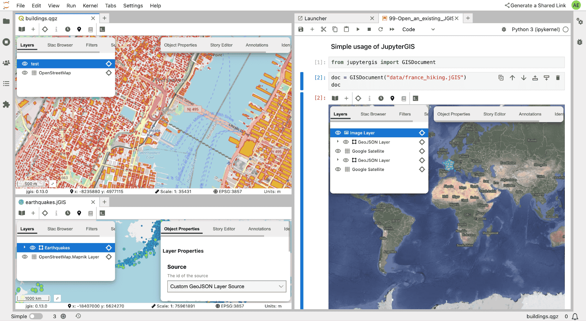
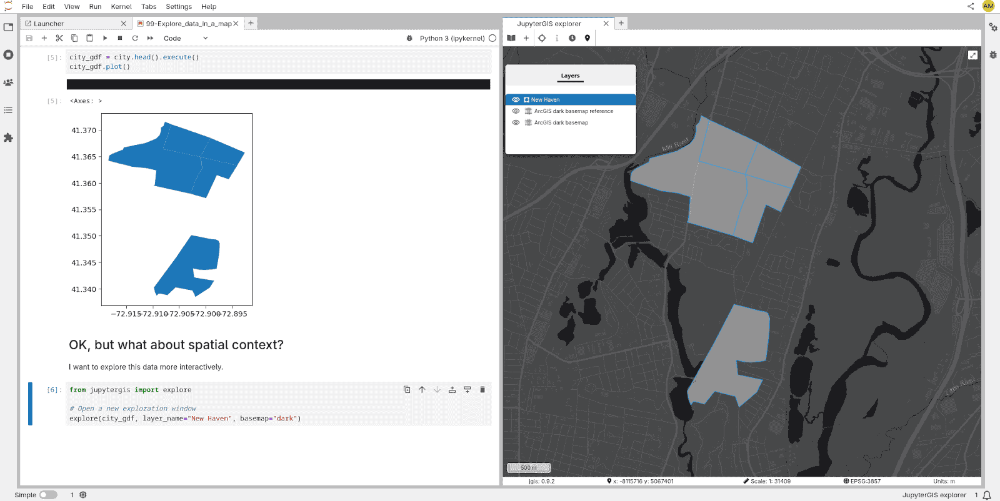
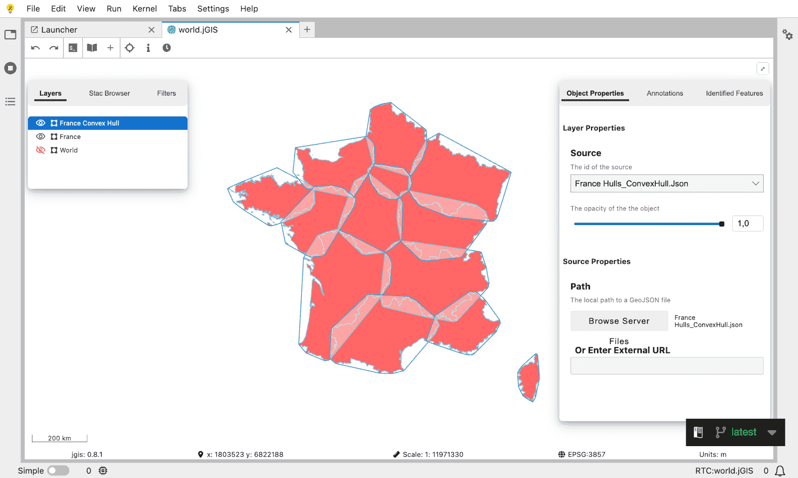
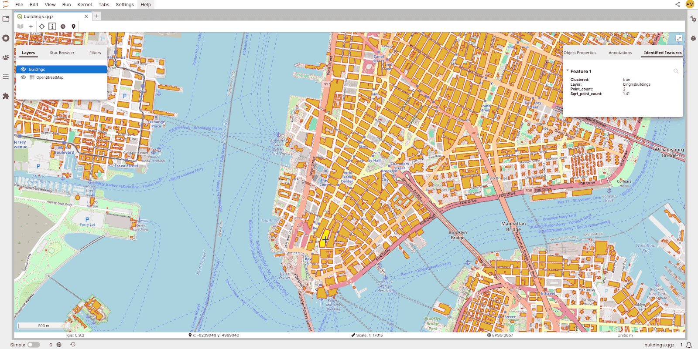
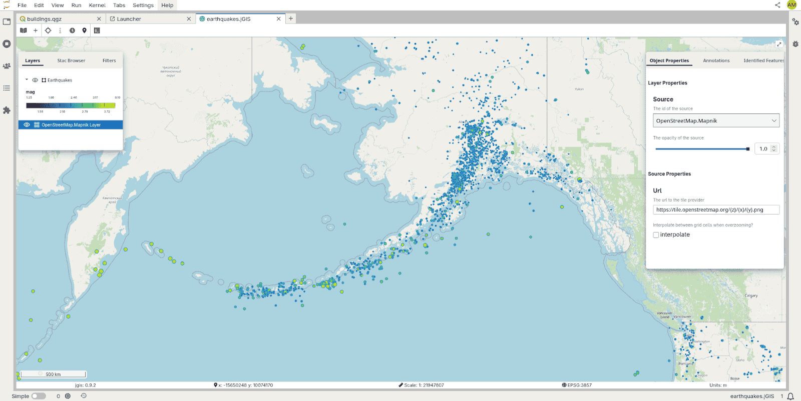
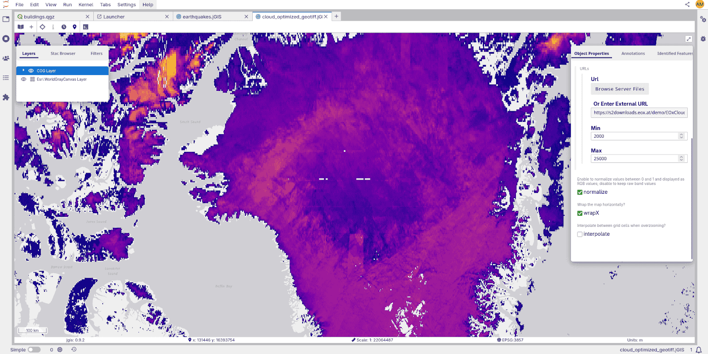
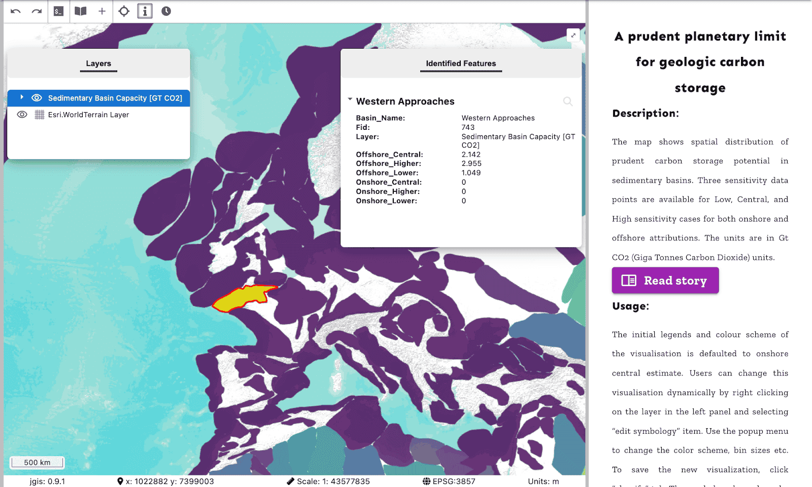
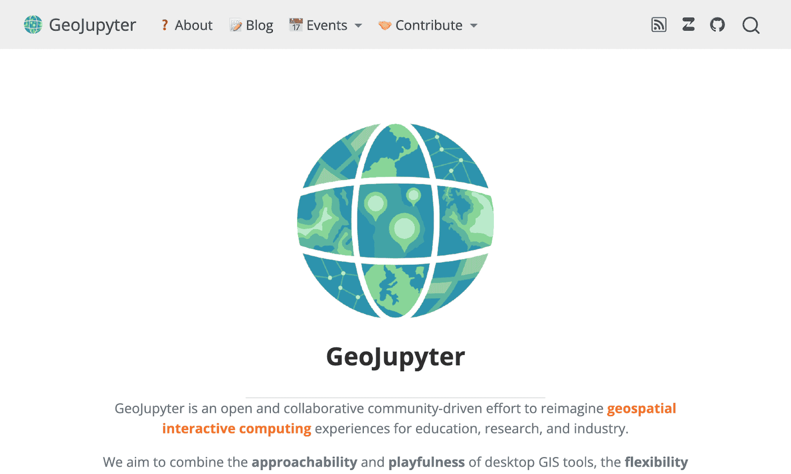
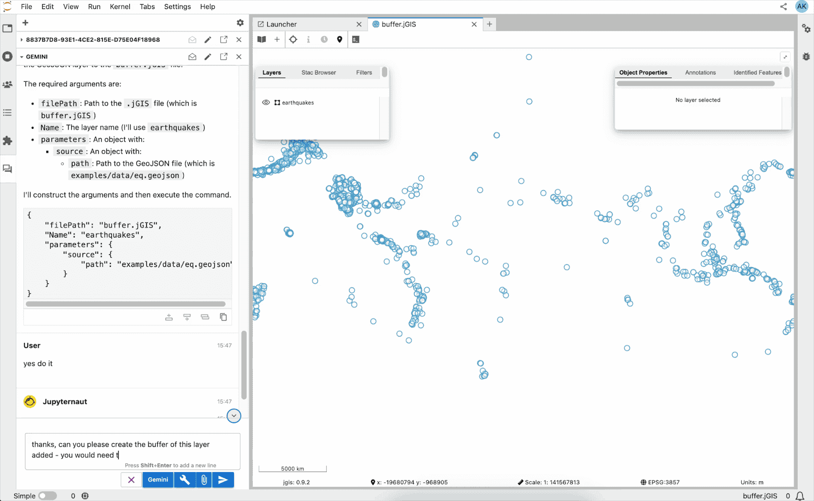

# Summary

JupyterGIS is a JupyterLab [@JUPY2018] extension that enables web-based Geographic Information System (GIS) workflows. It provides a familiar GIS interface inspired by traditional desktop GIS tools, real-time collaborative editing, and a Python API for programmatic control, making it a powerful tool for geospatial data analysis and visualization. JupyterGIS supports a wide range of geospatial data formats, including GeoTIFFs and Cloud-Optimized GeoTIFFs, Shapefile, GeoParquet, and PMTiles, and provides advanced features such as symbology editing, spatio-temporal animations, and a browser-based processing toolbox powered by WebAssembly (WASM) builds of GDAL [@GDAL2025].

# Statement of Need

Geospatial data analysis and visualization are essential in fields such as environmental science, urban planning, and disaster management. However, traditional GIS tools often lack **real-time collaboration** and integration with computational **notebooks**. JupyterGIS addresses these gaps by:

- Enabling **real-time collaborative editing** for GIS projects.
- Providing **interactive maps and geospatial visualizations within Jupyter notebooks**.
- Supporting **programmatic control** via a Python API, allowing for automation and reproducibility.
- Offering **browser-based access to GIS workflows**, reducing the need for desktop software.

# State of the Field

The geospatial software ecosystem comprises a broad diversity of tools addressing specific needs, including proprietary solutions and open-source alternatives, cloud-based platforms, and notebook-integrated workflows.

However, none of the existing open-source offerings address the growing demand for real-time collaboration.

## Closed-Source Desktop Solutions

**ESRI's ArcGIS** remains the dominant proprietary GIS platform, offering comprehensive tools for data management, analysis, and visualization. While ArcGIS Online provides cloud-based collaboration features, it is not as instantaneous. Edits are synchronized at scheduled intervals or manually, not in real time.

## Open-Source Desktop Solutions

**QGIS** is the leading open-source desktop GIS, renowned for its extensibility, support for diverse data formats, and vibrant community.

It provides a powerful alternative to proprietary software but does not allow real-time collaborative editing of GIS documents. As a desktop application, it must be installed on the user’s device.

## Proprietary Cloud-Based Platforms

**Google Earth Engine** enables large-scale geospatial analysis in the cloud. However, its focus on script-based workflows and lack of interactive, collaborative editing make it less suitable for teams needing real-time collaboration.

## In-Notebook Tools

Libraries like [ipyleaflet](https://github.com/jupyter-widgets/ipyleaflet) and [folium](https://github.com/python-visualization/folium) bring interactive mapping to Jupyter notebooks. While useful for exploratory analysis, these tools lack a graphical user interface for non-developers willing to create GIS documents with advanced layer styling.

# JupyterGIS

JupyterGIS brings a collaborative, desktop-style GIS experience to the web, enabling real-time coediting of GIS documents directly in JupyterLab.



## Supported Layer Types

JupyterGIS supports a broad range of layer types, coverring many **geospatial data formats** including vector formats (**GeoJSON**, **Shapefile**, **GeoParquet**), raster formats (Cloud-Optimized GeoTIFFs ), as well as **raster and vector tile layers**.

## Real-time Collaboration and Annotation

JupyterGIS enables live multi-user collaboration: track cursors, follow others’ views, annotate maps, and discuss geographic context in real time.


## Python API

JupyterGIS provides a **Python API** for editing GIS documents from Jupyter notebooks and consoles, integrating into Jupyter’s rich display system. The Python API operates on the shared document like a collaborator in the coediting system.



## Deployment Options

JupyterGIS can be deployed in any Jupyter-based environment from **JupyterHub** to **JupyterLite**.

## Extensibility

JupyterGIS can be extended with plugins. Several extensions are available. Most notably, the [**JupyterGIS-tiler**](https://github.com/geojupyter/jupytergis-tiler) plugin allows to display Xarray variables as layers, integrating JupyterGIS with the Pangeo ecosystem.

## The Processing Toolbox

JupyterGIS includes a set of commonly used processing operations such as buffering, dissolving, centroid computation, and generating convex hulls.



## Support for QGIS Project Files

JupyterGIS allows for editing QGIS project files (`.qgz` and `.qgs`) directly, with a partial support of the QGIS features.



## Symbology and Styling Options

The symbology panel enables users to style vector layers with graduated, categorized, canonical, and heatmap renderers, while raster layers support single-band and multi-band visualization.





## Interactive Tools and Dynamic Visualizations

- The “identify” tool allows clicking on features to view their attributes, similar to traditional desktop GIS exploration.
- Time-dependent datasets can be animated, supporting visualization of changes across time such as environmental monitoring or temporal event sequences.

## Story Maps

JupyterGIS includes a Story Map feature, an interactive combination of a JupyterGIS map, text, images, and multimedia, to include a compelling narrative in a map.

# Installation

JupyterGIS can be installed from PyPI with pip:

```
python -m pip install jupytergis
```

Or obtained from conda-forge [@CONDAFORGE2025] with mamba.

```
mamba install -c conda-forge jupytergis
```

# Software Design

## Collaborative Aditing as a First-Class Requirement: Shaping the JupyterGIS Document Model

Collaborative editing has transformed how we work, eliminating the inefficiencies of email-based document exchanges and boosting collective productivity. Looking ahead, the potential of co-editing extends far beyond text documents, especially in designing complex systems that require diverse expertise—such as climate modeling, agriculture, ecology, and urban planning.

We believe collaborative editing will soon be a standard expectation for most users:

- Self-collaboration: As web-based interfaces become the norm, users will expect to seamlessly edit the same document across multiple windows or devices, without locking conflicts.
- Real-time sharing: Users will demand the ability to share a link and collaborate instantly, without risking data corruption.

Building these capabilities into an application from the start is far more effective than retrofitting them later.

## Building upon the JupyterLab Application Framework

Professionals depend on advanced authoring tools — IDEs, CAD modelers, and GIS applications — for daily productivity. They have high expectations for tools that they use for extended periods of time: extensibility, customization, theming, internationalization, scriptability, and cross-device workflows are strong requirements.

JupyterLab delivers these features as a robust framework, backed by a thriving extension ecosystem and a large user base. It supports real-time collaboration via CRDTs (Conflict-free Replicated Data Types) [@CRDT2011] through the YJS framework [@YJS2015]. By building on JupyterLab, JupyterGIS inherits these strengths—seamlessly integrating with the Jupyter ecosystem (notebooks, kernels, rich display) and enabling serverless deployments with JupyterLite.

## The JupyterGIS Stack

JupyterGIS leverages the following technologies:

| Frontend | JupyterLab application framework + React |
| Collaboration | Collaborative editing with YJS and PyCRDT [@YJS2015] |
| Processing | WebAssembly-powered GDAL [@GDAL2025] toolbox |
| Visualization | OpenLayers [@OpenLayers2025] for map rendering |

# Research Impact

## Deployments on Institutional Infrastructure

JupyterGIS has been deployed across several major **institutional research infrastructures**:

- JupyterGIS is available on the [Copernicus Data Space Ecosystem (CDSE)](https://jupyterhub.dataspace.copernicus.eu).
- It has been integrated with the Open OnDemand portal [@OpenOnDemand2018], and deployed on the instance of the University of Oslo.
- JupyterGIS is integrated in the Galaxy Toolbox [@Galaxy2024] and deployed on the [Galaxy Europe deployment](https://usegalaxy.eu) of EOSC at usegalaxy.eu. It will soon be installed on the Earth Science thematic node of EOSC. More details on the Galaxy integration are available in an [article](https://galaxyproject.org/news/2025-05-20-jupytergis/) published on the blog of the Galaxy project.

## Public Deployments

JupyterGIS is accessible through multiple public deployments:

- Ready-to-use JupyterGIS environments are available via Binder [@BINDER2018], with direct access provided in the JupyterGIS GitHub repository.
- The repository also features a **JupyterLite-based deployment**, a fully static solution that runs in the browser using **WebAssembly** for Python execution. This approach eliminates the need for cloud infrastructure, enabling **scalable and lightweight deployments anywhere**.

## Supporting Scientific Publications

JupyterGIS underlies an interactive map of global subsurface CO₂ storage potential in sedimentary basins. This [interactive map](https://cdr.apps.ece.iiasa.ac.at/sedimentary-basin-level-maps), hosted by the International Institute for Applied Systems Analysis (IIASA), was deployed using JupyterLite as supplementary material for an article published in Nature [@NATURE2025].



# Community and Contributions

## Contributing to JupyterGIS

JupyterGIS is available under the BSD 3-Clause License. Contributions are welcome on the [GitHub repository](https://github.com/geojupyter/jupytergis). The [documentation](https://jupytergis.readthedocs.io) is available online on ReadTheDocs. We host community discussions on a [public channel](https://jupyter.zulipchat.com/#narrow/channel/471314-geojupyter).

## The GeoJupyter Initiative

JupyterGIS has been incorporated as the first and central component of a broader initiative: [GeoJupyter](https://geojupyter.org/), a community-driven effort to reimagine geospatial interactive computing experiences for education, research, and industry.



# Future Work

Our roadmap includes the following future developments:

## Integration with openEO

JupyterGIS will soon support openEO [@OPENEO2021] [process graphs](https://api.openeo.org/v/0.3.0/processgraphs/) as a native layer type, dynamically rendered as XYZ tiles in JupyterGIS Next. This requires extending both the document model and the Python API to embed and serialize openEO process graphs directly within JupyterGIS documents.
This integration seamlessly connects cloud-based geospatial processing with collaborative document editing, unlocking new workflows for users.

## An R API

To extend JupyterGIS to the R ecosystem, we will develop an R API mirroring the functionality of the Python API.

This API will interact with the collaborative editing framework and the underlying data model, just as the Python API does. The primary requirement is to create R bindings for the [y-crdt](https://github.com/y-crdt/y-crdt) Rust library, the same library that underlies the collaborative data model in the backend and the Python bindings.

## JupyterLite-AI

We will integrate JupyterGIS with JupyterLite-AI by exposing JupyterGIS features as tools to Large Lanaguage Models (LLMs). By leveraging the JupyterLab application framework, we ensured that all user actions available in the UI are backed by JupyterLab commands, which are exposed to JupyterLite-AI's tool calling system.

In the screenshot below, we showcase an early example of such an integration.



# Acknowledgments

JupyterGIS was initially developed through a collaboration between **QuantStack**, the **Simula Research Laboratory**, and the **Eric and Wendy Schmidt Center for Data Science & Environment at UC Berkeley** (DSE), with additional contributions from community members.

- **QuantStack** and **Simula Research Laboratory** received funding from the European Space Agency (**ESA)** through the Open Call for Proposals for EO Innovation.
- QuantStack secured additional funding from the Centre National d’Études Spatiales (**CNES**) to specifically develop the STAC browser and story maps features.
- QuantStack contributed further to the project through unfunded efforts.
- The **DSE** funded the contributions of its researchers to the project.

# AI Usage Disclosure

The development of JupyterGIS relied entirely on **human expertise** and traditional software engineering practices. While we leveraged developer productivity tools, such as IDE features for code auto-completion and suggestions, every contribution, including code, documentation, and design, underwent review by the core team.
This article was written entirely by humans, though we used productivity tools for grammatical corrections and proofreading.

# References
